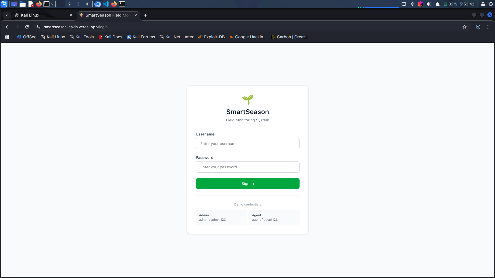
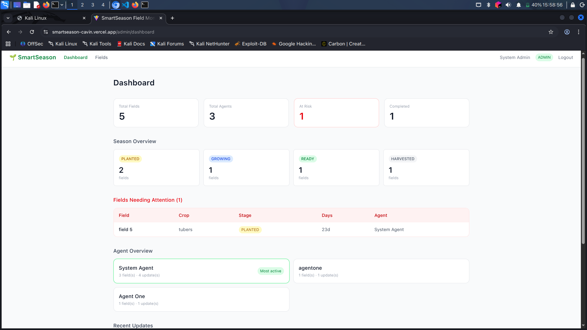
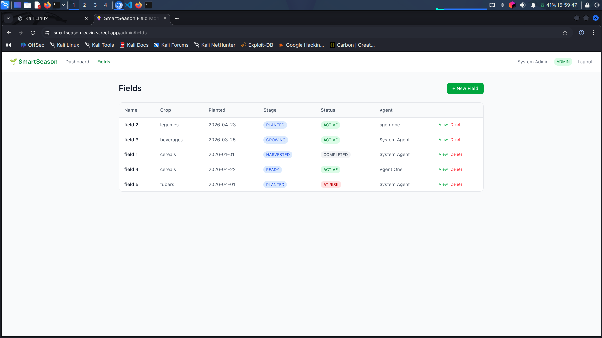
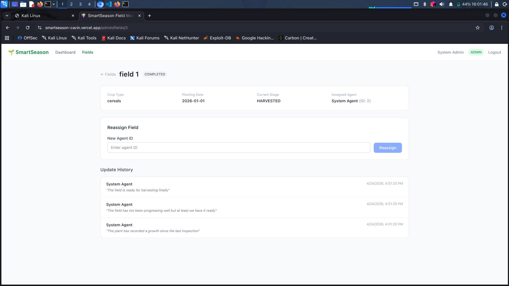
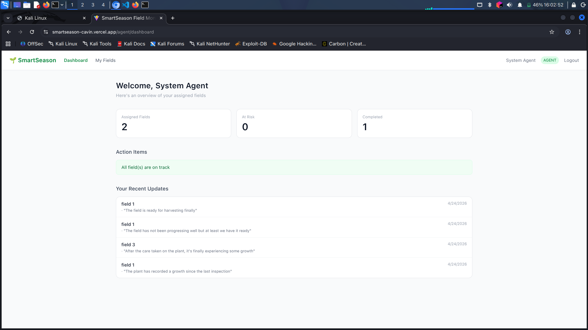
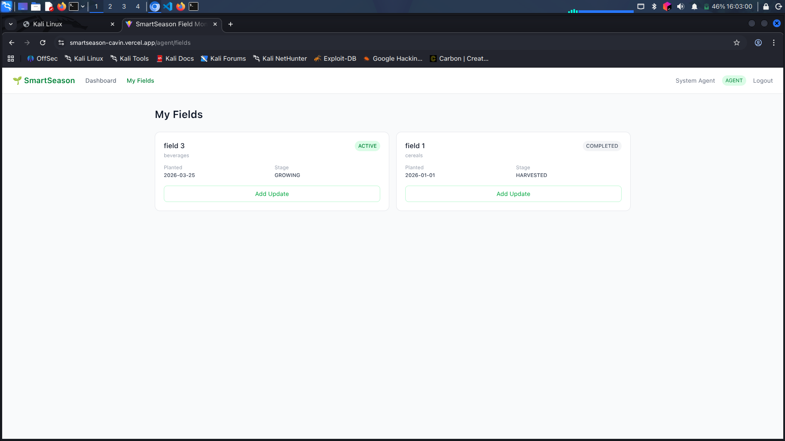
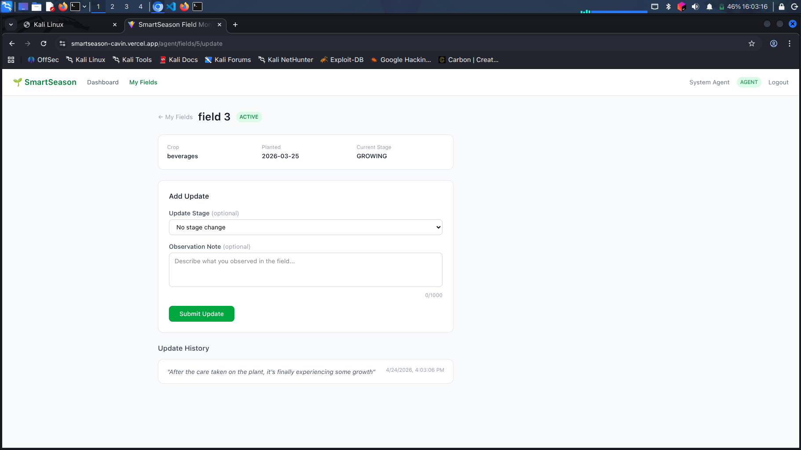

# SmartSeason Field Monitoring System (SFMS)

A web application that helps track crop progress across multiple fields during a growing season.

---

> [!NOTE]
> The backend is hosted on Render's free tier which spins down after periods of inactivity. The first request may take 30 – 60 seconds to respond while the server wakes up. Subsequent requests will be fast. If Swagger UI doesn't load immediately, wait a moment and refresh.

## Tech Stack

**Backend**
- Kotlin + Spring Boot 3.5.x
- Spring Security + JWT authentication
- PostgreSQL
- Docker (database)
- SpringDoc OpenAPI (Swagger UI)

**Frontend**
- React + TypeScript
- Vite

---

## Getting Started

### Prerequisites
- JDK 21
- Docker and Docker Compose
- Node.js 18+

### Backend Setup

1. Clone the repository
```bash
   git clone https://github.com/devcavin/smartseason-field-monitoring-system
   cd smartseason-field-monitoring-system/backend
```  


### Configuration

The following environment variables are used:

- SpringBoot
    - JWT_SECRET
    - FRONTEND_URL
    - SPRING_DATASOURCE_PASSWORD
    - SPRING_DATASOURCE_URL
    - SPRING_DATASOURCE_USERNAME

- Vite
    - VITE_API_URL

Default values are provided for local development.

2. Run the application
```bash
   ./gradlew bootRun
```

The API will be available at `http://localhost:8080`
Swagger UI is available at `http://localhost:8080/swagger-ui/index.html`

### Frontend Setup

```bash
cd frontend
npm install
npm run dev
```

The frontend will be available at `http://localhost:5173`

---

## Demo Credentials

| Role  | Username | Password |
|-------|----------|----------|
| ADMIN | admin    | admin123 |
| AGENT | agent   | agent123  |

---

## API Overview

| Method | Endpoint | Role | Description |
|--------|----------|------|-------------|
| POST | `/auth/register` | Public | Register a user |
| POST | `/auth/login` | Public | Login and receive JWT |
| GET | `/admin/dashboard` | Admin | Admin dashboard overview |
| GET | `/admin/fields` | Admin | All fields |
| POST | `/admin/fields` | Admin | Create a field |
| GET | `/admin/fields/{id}` | Admin | Get field by ID |
| PATCH | `/admin/fields/{id}/reassign` | Admin | Reassign field to agent |
| DELETE | `/admin/fields/{id}` | Admin | Delete a field |
| GET | `/admin/fields/{id}/updates` | Admin | View all updates on a field |
| GET | `/agent/dashboard` | Agent | Agent dashboard overview |
| GET | `/agent/fields` | Agent | Agent's assigned fields |
| GET | `/agent/fields/{id}` | Agent | Get specific assigned field |
| POST | `/agent/fields/{id}/updates` | Agent | Add update to a field |
| GET | `/agent/fields/{id}/updates` | Agent | View updates on assigned field |

---

## Design Decisions

### Authentication
JWT-based stateless authentication. On login or register the server returns a signed token
valid for 24 hours. The client includes this token in every subsequent request via the
`Authorization: Bearer <token>` header. No refresh token is implemented — this is a deliberate
trade-off to keep the implementation simple and focused for the scope of this assessment.

### Role-Based Access
Two roles — `ADMIN` and `AGENT`. Access is enforced at two layers:
URL pattern matching in `SecurityConfig` and `@PreAuthorize` annotations on each controller
method. This redundancy makes the access rules explicit and visible at the point of use.

### Field Visibility
Agents only see and interact with fields assigned to them. When an agent requests a field
they are not assigned to, the system returns `404 Not Found` rather than `403 Forbidden`.
This is intentional — it avoids leaking the existence of fields the agent has no business knowing about.

### Planting Date
Planting dates are restricted to past or present dates only via `@PastOrPresent` validation.
No upper lookback limit is enforced. This is a deliberate decision to support crops with
varying maturity periods including perennial crops such as fruit trees which can take
several years to reach harvest stage. A blanket 365-day limit would incorrectly reject
valid fields for such crops.

### Data Model
`FieldUpdate` is an append-only log of changes made to a field. When an agent submits an
update, the field's current stage is updated and the update is recorded separately.
This preserves a full history of how a field progressed through the season.

---

## Field Status Logic

Each field has a computed status derived from its current stage and the number of days
since planting. The logic is intentionally simple and transparent.

| Status | Condition |
|--------|-----------|
| `COMPLETED` | Field stage is `HARVESTED` |
| `AT_RISK` | Field has exceeded the expected duration for its current stage |
| `ACTIVE` | All other cases |

#### Field Stage Transitions
Stage progression is strictly sequential: PLANTED → GROWING → READY → HARVESTED.
Skipping stages is rejected at the service layer with a descriptive error indicating
the expected next stage. The frontend enforces this further by only offering the
valid next stage in the update form.

**Stage thresholds used to determine AT_RISK:**

| Stage | Threshold |
|-------|-----------|
| `PLANTED` | > 14 days with no progress |
| `GROWING` | > 60 days with no progress |
| `READY` | > 75 days since planting with no harvest |

These thresholds are based on a general annual crop cycle (approximately 90 days to
maturity). They are configurable in `FieldStatusService` and can be adjusted to fit
specific crop types in a production implementation.

> [!NOTE] 
> For perennial crops with longer maturity periods, these thresholds would need to be adapted. A future improvement would allow per-field configurable maturity periods at the time of field creation.

---

## Live Demo

| Service | URL |
|---------|-----|
| Backend API | https://sfms-server.onrender.com |
| Swagger UI | https://sfms-server.onrender.com/swagger-ui/index.html |
| Frontend |  https://smartseason-cavin.vercel.app |

## Screenshots

### Authentication
| Login |
|-------|
|  |

### Admin View
| Dashboard | Fields | Field Detail |
|-----------|--------|--------------|
|  |  |  |

### Agent View
| Dashboard | My Fields | Add Update |
|-----------|-----------|------------|
|  |  |  |

## Assumptions

- A field name must be unique per agent. Two different agents can have fields with the
  same name but one agent cannot have two fields with identical names.
- A field is always created in the `PLANTED` stage unless explicitly specified otherwise.
- Only agents can be assigned to fields. The system does not validate the role of the
  assigned user at the database level but enforces it at the service layer.
- The system assumes all dates are in the server's local timezone.

---

## License

[MIT LICENSE](./LICENSE)